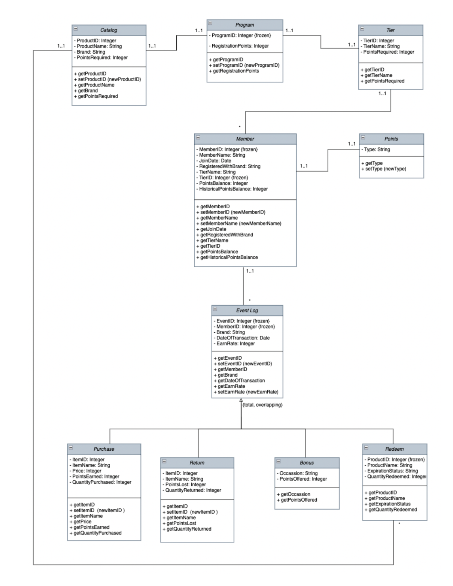
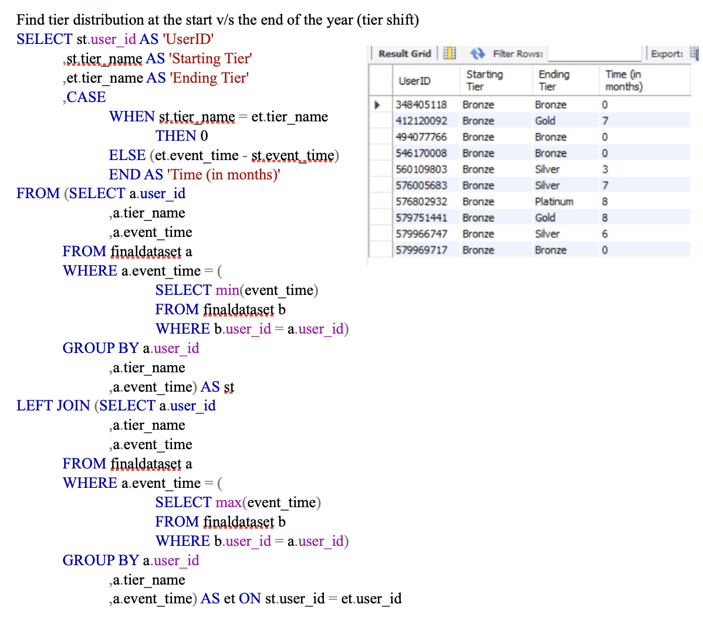
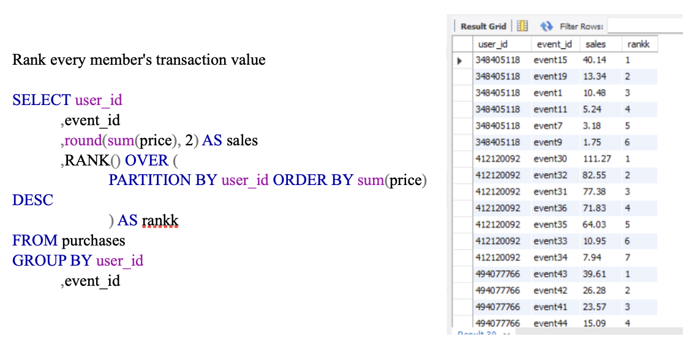
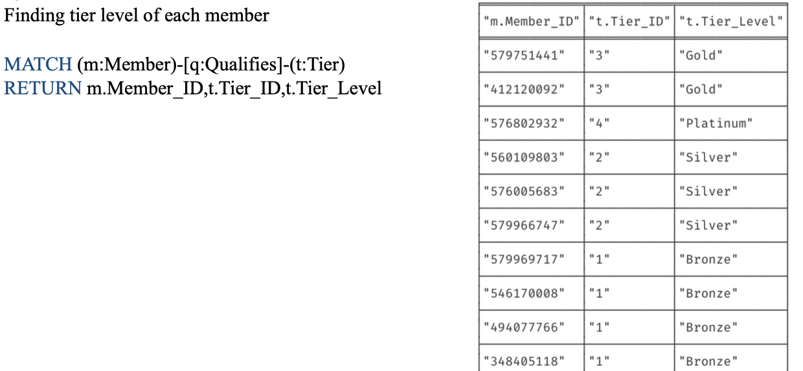

## Database design and implementation for a rewards loyalty system 

Designing a database for any retailer to set up a rewards royalty program and showcasing ways to leverage information gained from the database

## Features

1] A customer table to capture customer details when they register online/offline. This table must
have a unique identifier for every member followed by information around which tier they fall into
and their points balance. They must also capture which brand they are registered through into the
program

2] An events log table to capture every event (interaction) that a customer has with the program.
Some examples are registration, purchase, return, redemption, etc. This table is the backbone to the
program as every other table can be derived using this

3] A rewards catalog that can be accessed by members of the program to redeem the points that they
accumulate over time due to their interaction with the programs. The catalog is not just restricted to
products but will have choices like monetary rewards, access to exclusive events, vouchers and
coupons, and other benefits

4] Tiers are awarded to members that are involved more in the program via spending and other
interactions. These tier thresholds need to be in place to clearly distinguish members are reward
them accordingly as each tier will have different access levels to rewards catalog and ultimately
make the program tier centric. This will drive members to spend more and this is beneficial for the
business

5] Points are rewarded to members that interact with the program. They can be earned via
transactional and non-transactional ways. Different tiers earn points at different rates. The lowest
tier earns 1pt/$ spent whereas the topmost tier can earn 5pt/$ spent. Checks need to be in place
where the points earned will expire within 12 months if left untouched

## A complete conceptual data model using UML class diagram

## Queries 

SQL and NoSQL queries were perfomed on the database to gain several insights into customer base and their transactional habits, a few are shown as below:

## Summary

Using this relational database a retailer can keep track of their loyalty program. We have allowed
for there to be a scope of expansion to the data model as well, like in terms of tier level, as the years
go by the cut off points for each tier level can be changed or even expanded. Limitations of this
project include the lack of being able to implement all the tables in NoSQL given the size of our
database (event log containing 1000’s of records). However, when completed this relational
database can be lucrative to any retailer wanting to implement a rewards loyalty program as well as
be useful to their customers by providing them access to exclusive products and offers.

